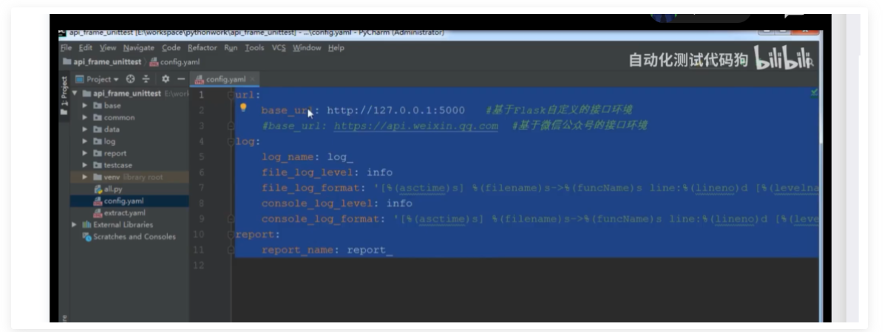
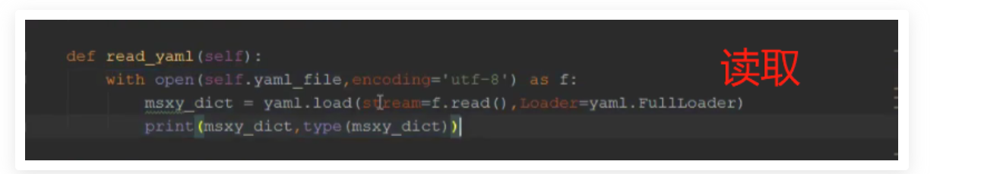
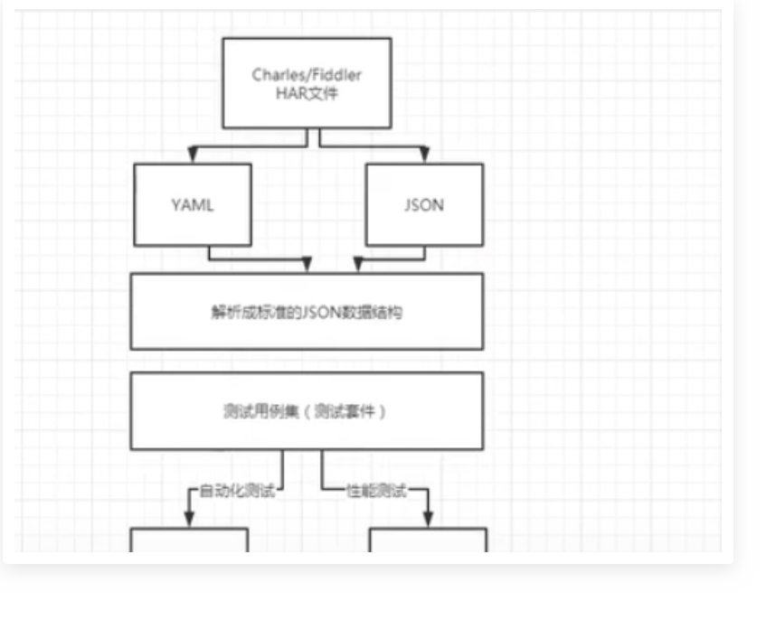
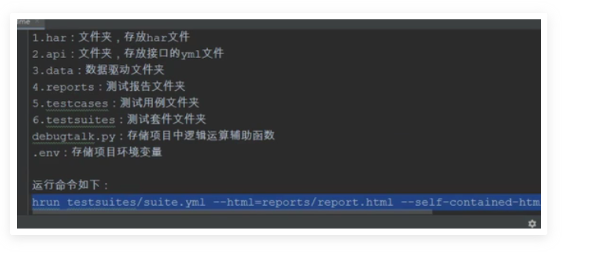
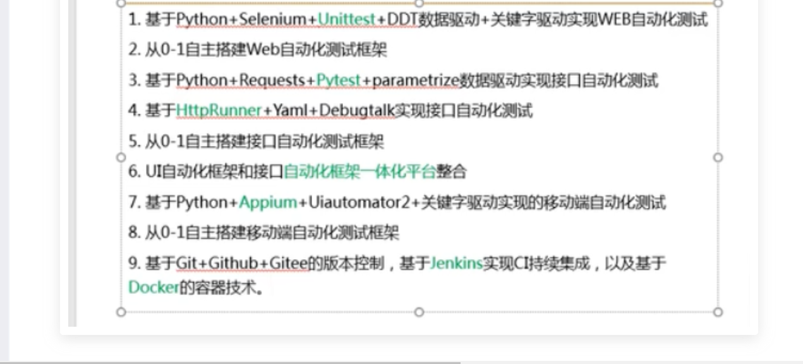

一、YAML

1、用途

1）做配置文件,配置全局的数据

eg:环境变量、数据库信息、账号信息、日志格式、日志格式名称

2）用于写测试用例(接口自动化测试用例)--用于数据驱动




2、yaml语法

yaml是一种数据格式（json），支持注释、换行、多行字符串、裸字符串等。


1）大小写敏感，区分

2）使用缩进来标识层级关系

3）缩进不管空格数量，只要层级的左边对齐

4）#表示注释


3、YAML与JSON对比

JSON

1）Map对象：键值对。（字典）

使用{}括起来，如：{name:哈哈}

2）数组，（列表list）

使用[  ]括起来,如[：{name:哈哈,age:18},{ ... }]


**YAML**

1)Map对象：键:(空格)对。（字典dict）

eg：

msxy:

​	  name: 百里

​      age: 18

一行的写法：

msxy: {name: 百里,age: 18}

2)数组，（列表list），用一组横线“-”开头的

eg:

msxy:

​	 - name: 百里

​     \- age: 18

一行的写法：

msxy:[{name:百里}，{age:18}]


二、YAML配置文件处理

```
读取和写入
```

\# 避免报警告需要加入：loader=yaml.FullLoader


\#有中文时避免写入allow_unicode=True



mode=' '更改权限

写入时：引用了dump方法

转换格式：allow_unicode=True


三、YAML实现接口自动化测试用例


【待学】


Httprunner框架


1、httprunner是面向http协议的测试框架。只需要去维护一份yaml/json文件就可以使用自动化测试。结合locust性能测试，线上性能监控，持续集成等多种需求，devops，requests

java：junit,testing python:unittest,pytest

自动化测试：httprunner,robotframework


2、设计理念

1）重复复用优秀的开源项目(不追求重复造轮子，而是讲轮子组装成战车)

2）约定大于配置（提升测试脚本的可维护性）

3）配置文件组织测试用例（yaml/json）

4）一次投入，多处复用

5）高度可扩展性




3、httprunner环境搭建


直接安装httprunner

pip install httprunner

pip install har2case


验证环境

hrun -V

har2case -V


五个命令

httprunner  主命令

hrun        httprunner的别名，用于运行yaml/json/pytest测试用例

hmake     httprunner make 的别名，将yaml/json转化成pytest文件

har2case httprunner har2case的别名，用于将har文件转化成yml/json文件

locust 用于性能测试


4、一分钟生成用例

fiddler找到对应的接口——file，export sessions—select sessions——保存在桌面，然后复制到pycharm中，运行

har2case gettoken.har -2y

生成.yaml后缀的用例


yaml格式

\#全局配置项

config

​       name：测试用例名称

​       ...

\#测试步骤

teststeps:

​	   name: 

​       requests:

​		      headers:


\#断言

validate

验证


运行yaml用例

hrun XXXXX.yaml


\#多个接口保存成一个har文件，若其中一个接口需要上一个接口的token值，则使用

extract:  

​       tokens:content.access_token

根据第二个返回值加断言


搭建框架





