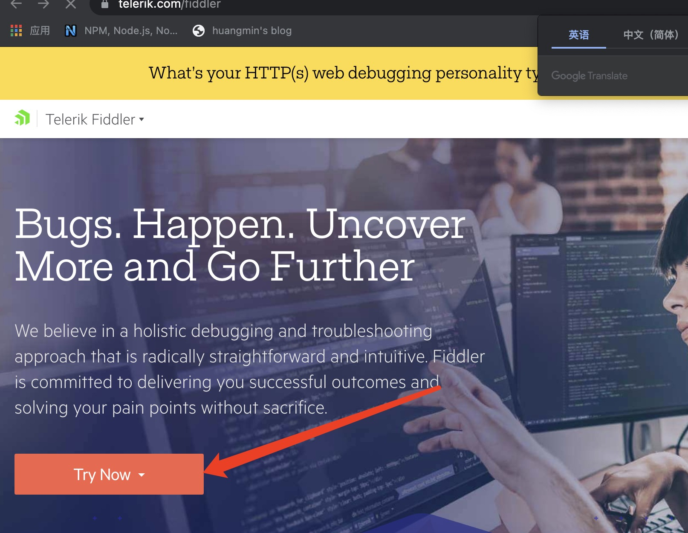
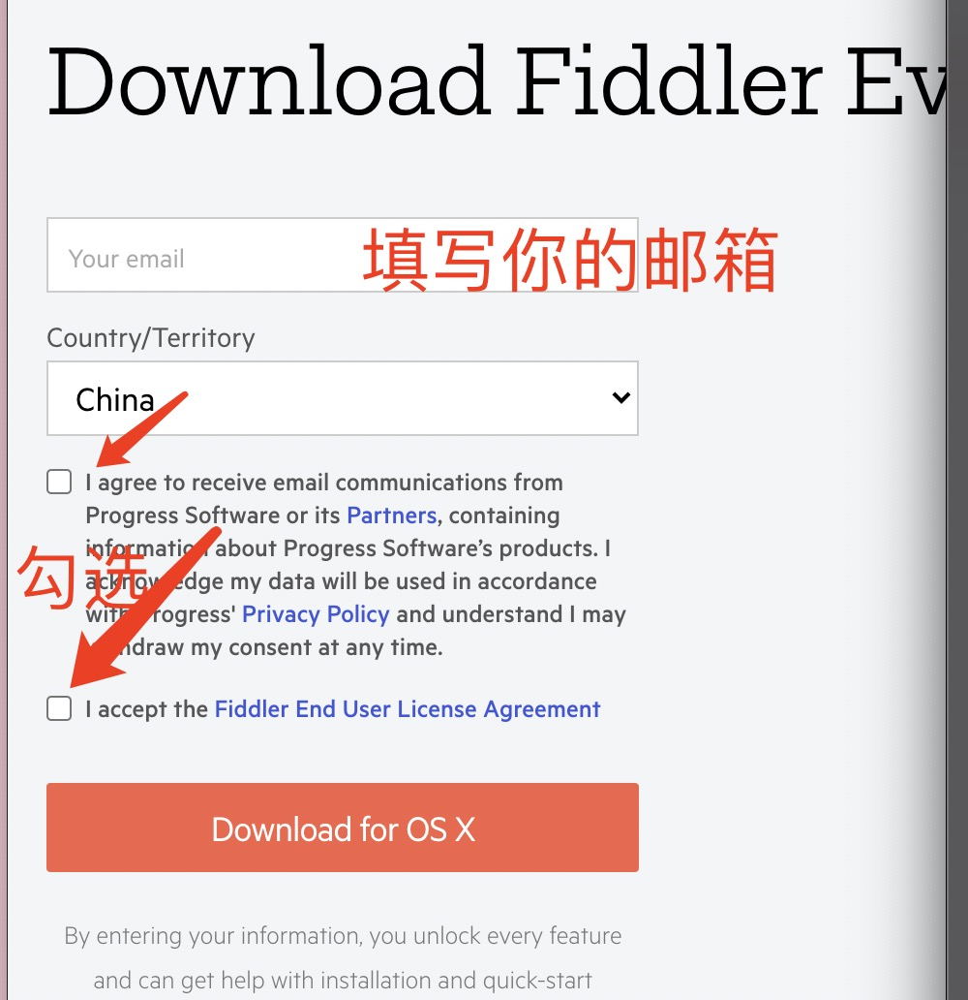
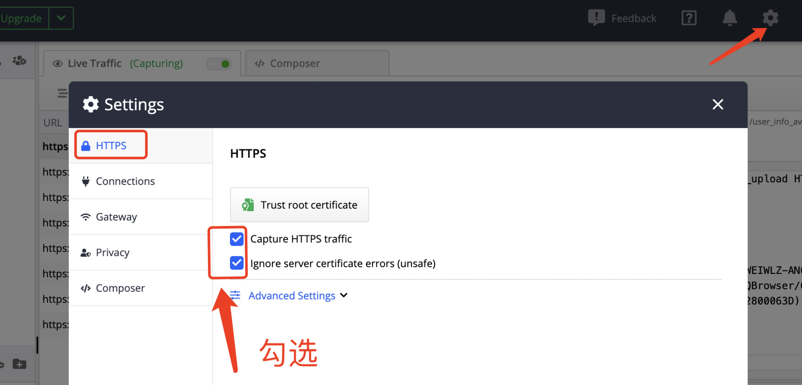
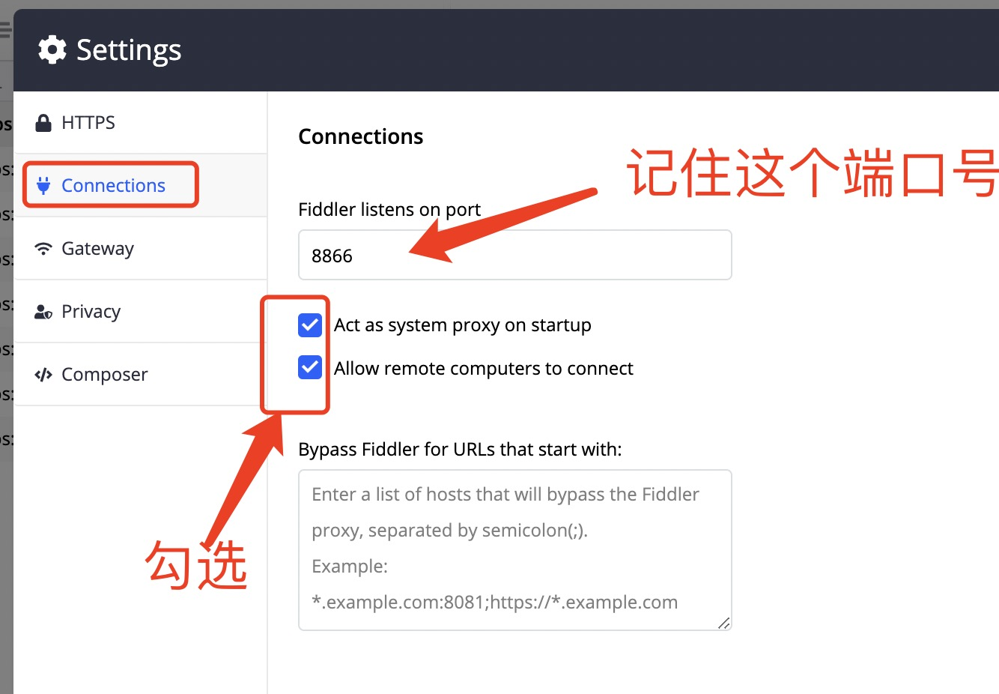
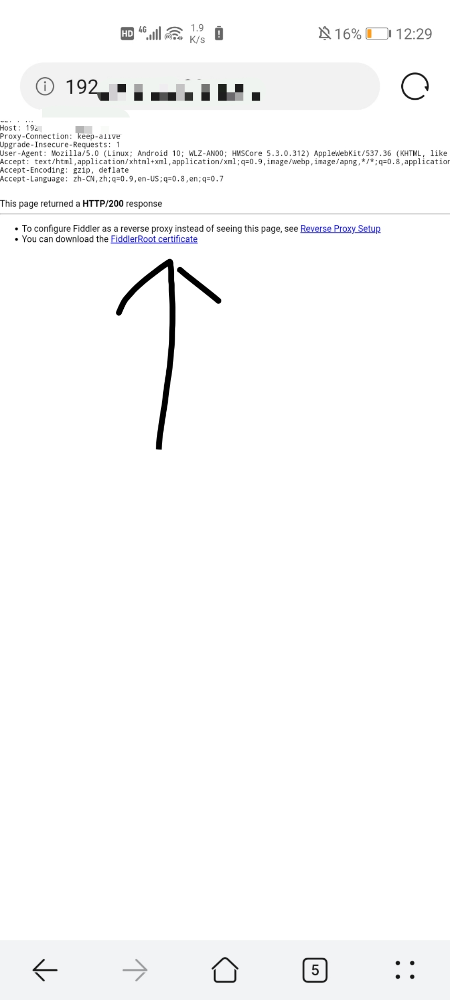

1、下载 fiddler everywhere

1)直接去官网下载->点击 try now

2)点击fiddler everywhere

3)填写邮箱及国籍，勾选两个勾选框，点击download 

4）正常安装

5）打开fiddler everywhere 进行登录，填写邮箱，在你填写的邮箱确认登录

6)进入fiddler，点击右上角的设置，点击https，勾选

7）点击connections,勾选，记住端口号，设置完成后点击save保存

8）手机抓包

a.确保手机与电脑处于同一局域网下

b.查看电脑的IP地址

（windows电脑：wins键+r  Mac：command+空格 打开终端）
windows查看IP：ipconfig

mac查看ip:ifconfig

c.给连接的Wi-Fi设置代理服务器

d.手机安装证书
打开浏览器，输入https://你的IP:端口号 ，点击fiddlerRoot certficate下载证书

然后就可以对手机进行抓包啦

